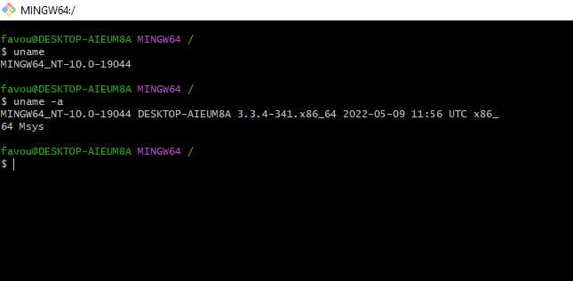

# Altschool Cloud Exercise 002
## 10 more linux commands with examples

 

<ol>

<li>
uname: uname is used to show the information about the system your Linux distro is running. Using the command “uname -a” prints most of the information about the system. This prints the kernel release date, version, processor type, etc.

</li>

 

<li>
ping: ping is used to check your connection to a server. Wikipedia says, "Ping is a computer network administration software utility used to test the reachability of a host on an Internet Protocol (IP) network". Simply, when you type in, for example, “ping google.com”, it checks if it can connect to the server and come back. It measures this round-trip time and gives you the details about it. The use of this command for simple users like us is to check your internet connection. If it pings the Google server (in this case), you can confirm that your internet connection is active!

</li>

 
<li>
df: df command is used to get a report on the system’s disk space usage, shown in percentage and KBs. If you want to see the report in megabytes, type df -m
</li>
 
<li>
du: If you want to check how much space a file or a directory takes, the du (Disk Usage) command is the answer. However, the disk usage summary will show disk block numbers instead of the usual size format. If you want to see it in bytes, kilobytes, and megabytes, add the -h argument to the command line.
</li>
 
<li>
diff: Short for difference, the diff command compares the contents of two files line by line. After analyzing the files, it will output the lines that do not match. Programmers often use this command when they need to make program alterations instead of rewriting the entire source code.
</li>
 
<li>
echo: This command is used to move some data into a file. For example, if you want to add the text, “Hello, my name is John” into a file called name.txt, you would type echo Hello, my name is John >> name.txt
</li>
 
<li>
useradd, userdel: Since Linux is a multi-user system, this means more than one person can interact with the same system at the same time. useradd is used to create a new user, while passwd is adding a password to that user’s account. To add a new person named John type, useradd John and then to add his password type, passwd 123456789.

To remove a user is very similar to adding a new user. To delete the users account type, userdel UserName
</li>
 
<li>
hostname: If you want to know the name of your host/network simply type hostname. Adding a -i to the end will display the IP address of your network.
</li>
 
<li>
history: When you’ve been using Linux for a certain period of time, you’ll quickly notice that you can run hundreds of commands every day. As such, running history command is particularly useful if you want to review the commands you’ve entered before.
</li>
 
<li>
find: similar to the locate command, using find also searches for files and directories. The difference is, you use the find command to locate files within a given directory.

As an example, find /home/ -name notes.txt command will search for a file called notes.txt within the home directory and its subdirectories.

Other variations when using the find are:

<ul>
<li>To find files in the current directory use, find . -name notes.txt</li>
<li>To look for directories use, / -type d -name notes. txt
</li>
</ul>
</li>

</ol>

.png)

.png)

.png)

.png)

.png)

.png)

.png)

.png)